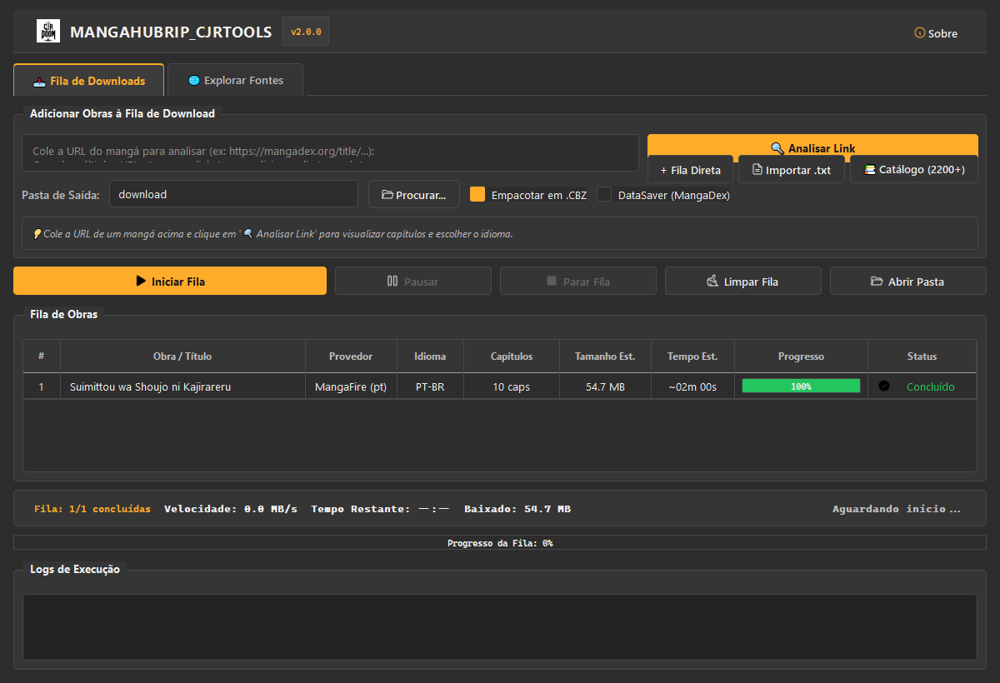
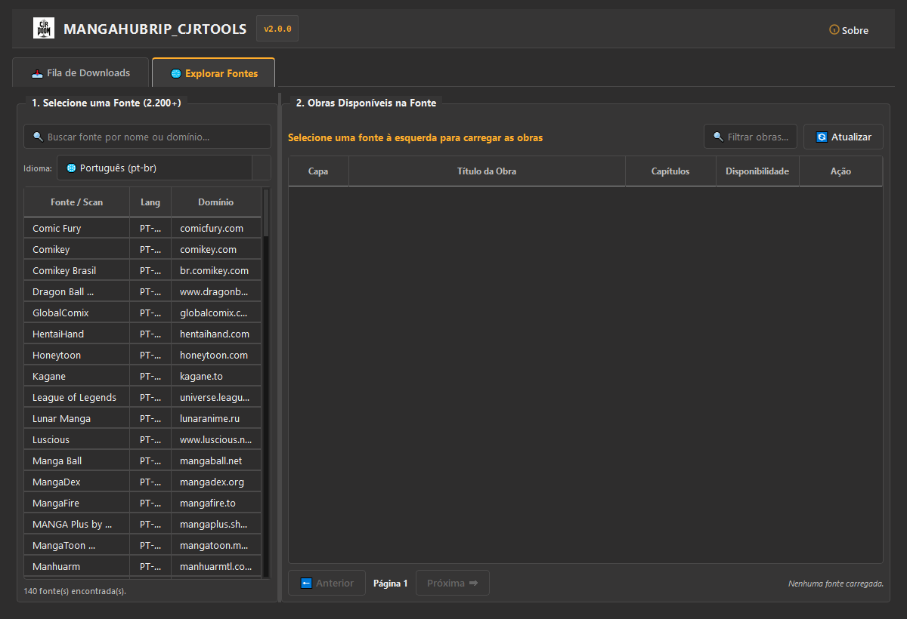
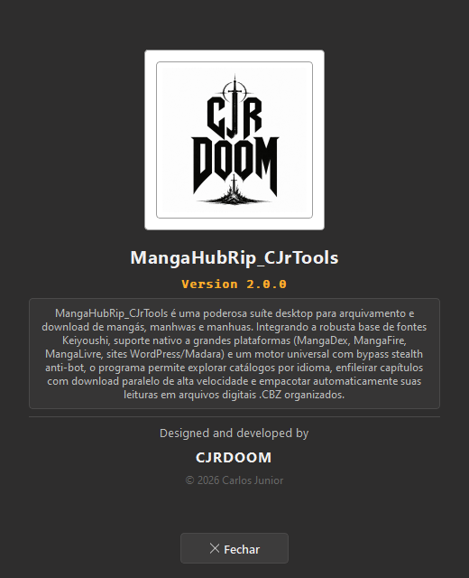

# MangaHubRip_CJrTools

<p align="center">
  
</p>

<p align="center">
  <strong>v2.0.0</strong> • <em>Designed and developed by <strong>CJRDOOM</strong></em> • © 2026 Carlos Junior
</p>

<p align="center">
  <a href="#-demonstração-visual-da-interface"></a>
  <a href="#-principais-recursos"></a>
  <a href="#-segurança-e-hardening-de-código"></a>
  <a href="#-instalação-e-execução"></a>
  <a href="https://github.com/carlosjrgit/MangaDex_Downloader_CJrTools/releases/tag/v2.0.0"></a>
</p>

> **MangaHubRip_CJrTools é uma poderosa suíte desktop para arquivamento e download de mangás, manhwas e manhuas. Integrando a robusta base de fontes Keiyoushi, suporte nativo a grandes plataformas (MangaDex, MangaFire, MangaLivre, sites WordPress/Madara) e um motor universal com bypass stealth anti-bot, o programa permite explorar catálogos por idioma, enfileirar capítulos com download paralelo de alta velocidade e empacotar automaticamente suas leituras em arquivos digitais .CBZ organizados.**

---

## 📸 Demonstração Visual da Interface

<p align="center">
  
</p>
<p align="center">
  <em>Interface Principal: Tema Dark Flat Geométrico, Gerenciador de Fila Sequencial, Telemetria ao Vivo e Controle Completo de Tarefas.</em>
</p>

<br>

<p align="center">
  
</p>
<p align="center">
  <em>Aba "Explorar Fontes": Navegue por mais de 2.200 extensões Keiyoushi, filtre por idioma (PT-BR, EN, etc.), visualize capas e adicione capítulos diretamente à fila.</em>
</p>

<br>

<p align="center">
  
</p>
<p align="center">
  <em>Diálogo "Sobre" oficial: Identidade visual CJR DOOM em alto contraste com descrição e créditos completos.</em>
</p>

---

## 🎨 Identidade Visual & Design System

O software foi construído seguindo rigorosamente a direção de design industrial e técnico:
- **Estética:** Dark, Minimal, Flat, Geometric e Technical (*"Flat, not plain"*).
- **Paleta de Cores Oficial:**
  - `Background`: `#2E2D2D`
  - `Surface`: `#363535`
  - `Surface Elevated`: `#3D3C3C`
  - `Surface Active`: `#454444`
  - `Accent / Destaque`: `#FFAC2B` (Laranja/Ouro)
  - `Border Strong`: `#9E9E9E`
  - `Text Primary`: `#F0F0F0` | `Text Secondary`: `#BDBDBD`
- **Tipografia:** *Inter* para a interface e *JetBrains Mono* para logs e valores técnicos.
- **Iconografia:** Vetorial e consistente baseada em *Phosphor Icons* (24px padrão).
- **Geometria:** Borda reta com raio padrão de `4px`. Zero gradientes chamativos, zero excesso de sombras ou glassmorphism.
- **Responsividade Dinâmica:** Layout inteligente que se adapta fluidamente em tela cheia ou janelas compactas, garantindo que nenhum texto seja cortado ou sobreposto.

---

## 🚀 Principais Recursos da Versão 2.0.0

### 🌐 1. Explorador de Fontes Keiyoushi (2.200+ Fontes)
- Integração nativa com o índice consolidado Keiyoushi (`index.pb`).
- Filtro imediato por idioma (Português `pt-br`, Inglês `en`, Espanhol `es`, Japonês `ja`, etc.).
- Paginação dinâmica e busca rápida de fontes por nome ou domínio.
- Botão direto **⬇️ Baixar** que abre um diálogo simplificado para escolher os capítulos e enviá-los à fila em 1 clique.

### ⚡ 2. Suporte Avançado a Plataformas & SPAs Modernas
- **MangaFire (`mangafire.to`):**
  - Navegação em catálogo paginado via Playwright headless stealth.
  - Seleção síncrona do idioma desejado (`LANG`) com suporte oficial a PT-BR.
  - Interceptação de tráfego de rede da API do leitor (`/api/chapters/<id>`) para coletar 100% das páginas na ordem correta.
  - Envio do cabeçalho `Referer` específico para a CDN de imagens, contornando bloqueios de acesso (HTTP 403).
- **MangaDex (API v5):** Consulta assíncrona, paginação rápida, deduplicação de grupos e modo DataSaver.
- **MangaLivre:** Captura completa com contorno de proteção.
- **Madara / WP-Manga (WordPress):** Compatível com dezenas de sites baseados em CMS de mangás.
- **Motor Universal Heurístico:** Extração por Playwright e sniffer de requisições de imagem para qualquer site web.

### 📥 3. Gerenciador de Fila & Telemetria em Tempo Real
- Execução sequencial com controle de threads paralelas de download (padrão: 4 workers).
- Métricas ao vivo: velocidade média de download em MB/s, tempo restante estimado (ETA) e bytes baixados.
- Controle de ciclo de vida: Pausar, Retomar e Parar fila a qualquer momento.
- Seleção flexível de capítulos:
  - **Todos:** Baixa a obra completa.
  - **Único:** Baixa apenas o capítulo selecionado (ex: `1`).
  - **Intervalo:** Baixa do capítulo X ao Y (ex: `1-10` ou `50-100`).
  - **Blocos:** Baixa de N em N capítulos.
  - **Personalizado:** Expressões combinadas (ex: `1, 3, 5-10`).

### 📚 4. Empacotamento Automático em `.CBZ`
- Renomeação numérica normalizada e sequencial de páginas (`001.jpg`, `002.jpg`...).
- Compactação direta no formato padrão para leitura digital (`.cbz`).
- Exclusão e limpeza automática das pastas de imagens temporárias após a criação do arquivo final.

---

## 🛡️ Segurança e Hardening de Código (SSDLC)

O projeto cumpre com as diretrizes do nosso ciclo de desenvolvimento seguro:
- **Proteção contra Path Traversal:** Canonicalização rigorosa com `safe_path_join`, impedindo escapes de diretório via nomes manipulados.
- **Sanitização de Nomes:** A função `clean_filename` neutraliza caracteres de controle ASCII, caracteres reservados do Windows (`CON`, `PRN`, `AUX`, `NUL`, etc.) e previne estouros de caminho (`MAX_PATH`).
- **Validação de Protocolos de Rede:** Rejeição estrita de esquemas inseguros (`file://`, `gopher://`, `javascript:`), restringindo a conexões remotas `http://` e `https://`.
- **Persistência Atômica:** Salvamento de fila de tarefas com substituição atômica (`os.replace`), prevenindo corrupção em caso de queda de energia ou desligamento repentino.
- **Sem Segredos Versionados:** Zero credenciais hardcoded, tokens de API ou arquivos privados no histórico do repositório.

---

## 📥 Instalação e Execução

### Opção A — Executável Pré-Compilado (Windows x64)
Para usuários que desejam executar o programa diretamente, sem instalar Python ou dependências:
1. Acesse a página oficial de [GitHub Releases](https://github.com/carlosjrgit/MangaDex_Downloader_CJrTools/releases/tag/v2.0.0).
2. Baixe o executável `MangaHubRip_CJrTools-v2.0.0-Windows-x64.exe`.
3. *(Opcional)* Verifique a integridade do arquivo através do arquivo `SHA256SUMS.txt`.
4. Execute o programa com dois cliques.

---

### Opção B — Executando a Partir do Código-Fonte

#### 1. Pré-requisitos
- Python 3.10 ou superior (testado em Python 3.14).
- Gerenciador de pacotes `pip`.

#### 2. Clonar o Repositório
```powershell
git clone https://github.com/carlosjrgit/MangaDex_Downloader_CJrTools.git
cd MangaDex_Downloader_CJrTools
```

#### 3. Instalar Dependências
```powershell
pip install -r requirements.txt
playwright install chromium
```

#### 4. Iniciar a Aplicação
- **Modo Gráfico (GUI):**
  ```powershell
  python mangadex_gui.py
  ```
- **Modo Linha de Comando (CLI):**
  ```powershell
  python mangadex-dl.py --url "https://mangafire.to/title/0rm7-monster-tale" --lang pt-br --all
  ```

---

## ⚙️ Compilação do Executável (.exe)

Caso deseje compilar seu próprio executável a partir do código-fonte:

```powershell
# 1. Instalar ferramentas de desenvolvimento
pip install -r requirements-dev.txt

# 2. Executar o PyInstaller utilizando a especificação oficial
pyinstaller MangaHubRip_CJrTools.spec --noconfirm
```

O executável final será gerado em `dist/MangaHubRip_CJrTools.exe`.

---

## 🧪 Execução dos Testes Automatizados

O repositório conta com uma suíte de testes unitários que valida a integridade de segurança, os tokens de design system e os motores de provedores:

```powershell
python -m unittest discover tests
```

---

## 📄 Licença e Direitos Autorais

- **Desenvolvido por:** CJRDOOM
- **Copyright:** © 2026 Carlos Junior. Todos os direitos reservados.
- O software é fornecido para fins educacionais e de arquivamento pessoal de obras legitimamente disponíveis publicamente na web.
